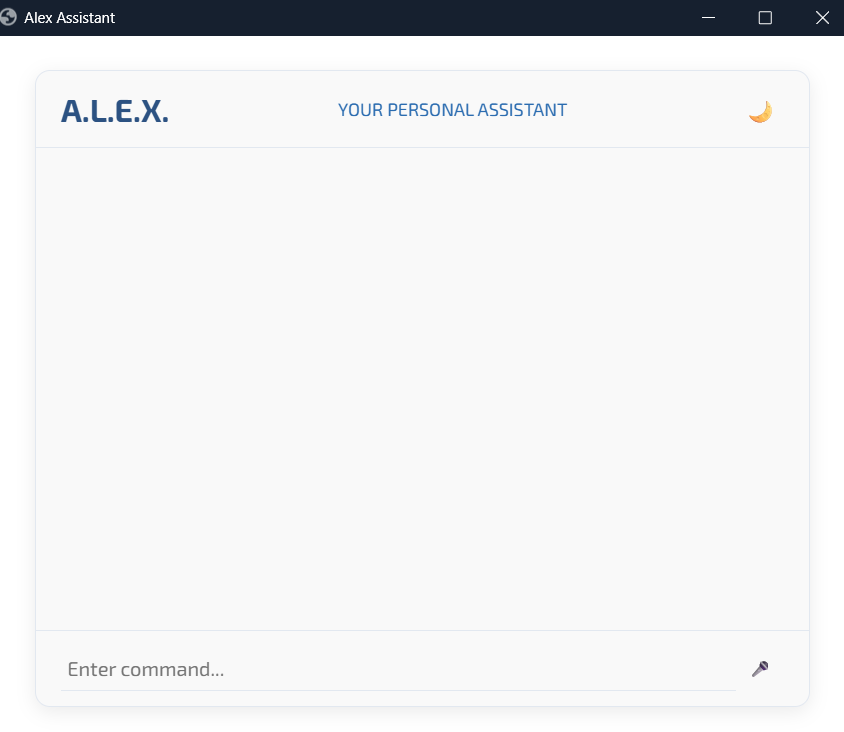
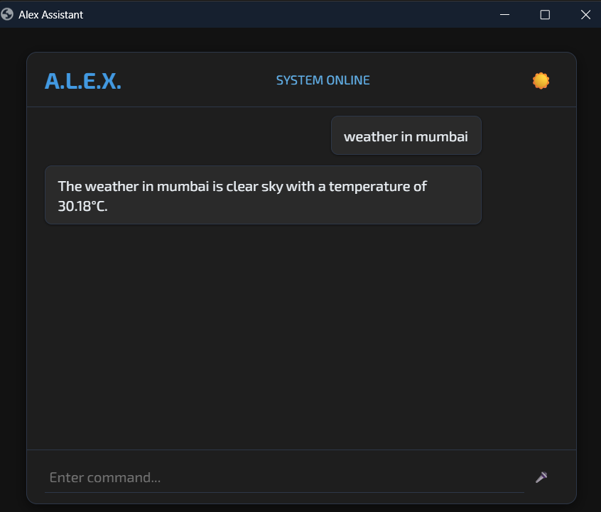

# Alex AI Chatbot 🤖

## 📌 Project Overview

Alex is a **web-based AI chatbot assistant** designed to interact with users through a clean and simple interface.
The chatbot processes user input and responds intelligently using backend logic written in **Python**, while the user interface is built using **HTML, CSS, and JavaScript**.

This project demonstrates the integration of a **Python backend with a responsive web frontend** to create an interactive chatbot experience.

---

## 🎯 Objective

The objective of this project is to develop a chatbot assistant that can:

* Accept user queries
* Process and respond to commands
* Provide a simple conversational interface
* Demonstrate basic AI interaction in a web environment

---

## 🛠️ Technologies Used

### Frontend

* HTML
* CSS
* JavaScript

### Backend

* Python

---

## ✨ Features

* Interactive chatbot interface
* Voice/microphone support UI
* Responsive web design
* Simple AI response logic
* Easy-to-use chat interface

---

## 📷 Project Screenshots

### Chatbot Interface



### Chatbot Interaction Example




---

## 📂 Project Structure

alex-ai-chatbot
│
├── main.py
│
└── web
    ├── index.html
    ├── script.js
    ├── style.css
    └── mic_icon.png

---

## ▶️ How to Run the Project

1. Clone the repository

```
git clone https://github.com/your-username/alex-ai-chatbot.git
```

2. Navigate to the project folder

```
cd alex-ai-chatbot
```

3. Run the Python backend

```
python main.py
```

4. Open the frontend page in your browser.

---

## 🚀 Future Improvements

* Integrate advanced NLP models
* Add speech recognition
* Connect chatbot with AI APIs
* Improve chatbot intelligence
* Enhance UI/UX design

---

## 👩‍💻 Author

**Amisha Kale**
BSc Computer Science Student


---

⭐ If you like this project, consider **starring the repository** on GitHub.
